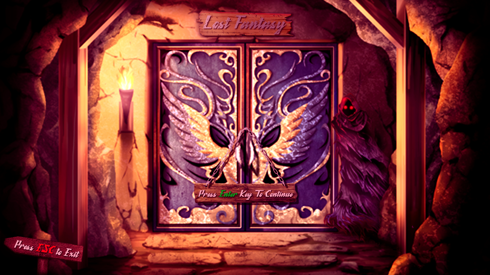

# LOST FANTASY

## ABSTRACT
&emsp;เนื่องในปัจจุบันสภาพจิตใจของผู้คนในสังคมส่อแววที่จะเป็นโรคซึมเศร้าจากการที่สั่งสมความเครียดในชีวิต 
    ไม่ว่าจะจากการทำงาน การเรียนหนังสือ หรือแม้กระทั้งการใช้ชีวิตในครอบครัว กลุ่มผู้พัฒนาจึงเล็งเห็นถึงชีวิตของ
    เด็กมหาลัยว่ามีการสั่งสมความเครียดจากการเรียนหนังสือ จึงได้ทำการพัฒนาเกมที่จะช่วยในการคลายความเครียด
    สะสมจากการใช้ชีวิต เพื่อให้ผู้เล่นได้รุ้สึกถึงความสนุกและผ่อนคลาย โครงงานนี้จึงถูกพัฒนาขึ้นโดยเป็น
    เกมแนว rough-like ขึ้นมาดังนี้
## TECHNOLOGY 
&emsp;C Language 
&emsp;Raylib
## Download And Play 
&emsp;[DOWNLOAD:(https://github.com/61070078/COMPRO)] 
&emsp;Download Zip 
&emsp;Go to --> SRC --> Main --> Lost_Fantasy.exe 
&emsp;And Play !!!!
## Developer 
|||||
|:---:|:---:|:---:|:---:|
|**Tae**|**Poon**|**Ice**|**Tag**|
