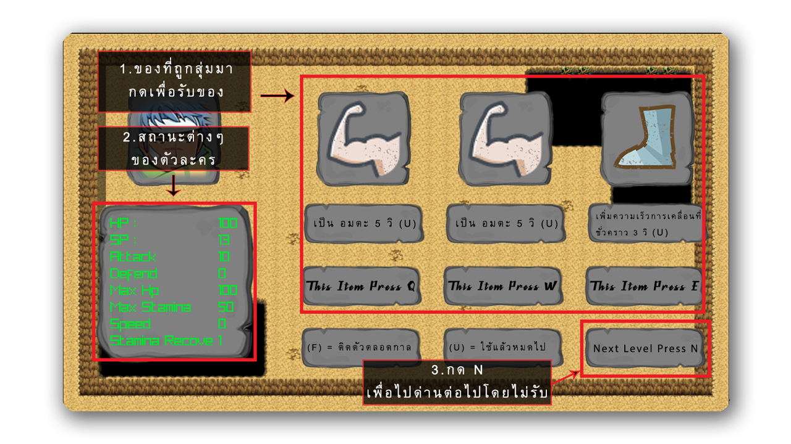

# 
LOST FANTASY

&emsp;&emsp;&emsp; 
## ABSTRACT 
&emsp;เนื่องในปัจจุบันสภาพจิตใจของผู้คนในสังคมส่อแววที่จะเป็นโรคซึมเศร้าจากการที่สั่งสมความเครียดในชีวิต 
    ไม่ว่าจะจากการทำงาน การเรียนหนังสือ หรือแม้กระทั้งการใช้ชีวิตในครอบครัว กลุ่มผู้พัฒนาจึงเล็งเห็นถึงชีวิตของ
    เด็กมหาลัยว่ามีการสั่งสมความเครียดจากการเรียนหนังสือ จึงได้ทำการพัฒนาเกมที่จะช่วยในการคลายความเครียด
    สะสมจากการใช้ชีวิต เพื่อให้ผู้เล่นได้รุ้สึกถึงความสนุกและผ่อนคลาย โครงงานนี้จึงถูกพัฒนาขึ้นโดยเป็น
    เกมแนว rough-like ขึ้นมาดังนี้
## TECHNOLOGY 
&emsp;1. C Language 
&emsp;2. Raylib
## Download And Play 
&emsp; 
&emsp;1. [DOWNLOAD:(https://github.com/61070078/COMPRO)] 
&emsp; 
&emsp;2. Download Zip File 
&emsp; 
&emsp;3. Go to folder--> SRC --> Main --> Lost_Fantasy.exe 
 
&emsp;4. And Play !!!!
## Tutorial 
&emsp; 
&emsp;1. กด Enter เพื่อเล่นเกม 
&emsp;2. กด ESC เพื่อออกจากเกม 
&emsp; 
&emsp;1. เลือดของศัตรู 
&emsp;2. ของที่มีอยู่ในตัวที่สามารถกดได้ 
&emsp;3. สถานะเลือดและพลังงานของเรา 
&emsp; 
&emsp;1. ของที่ถูกสุ่มมา กดเพื่อรับของ 
&emsp;2. สถานะต่างๆ ของตัวละคร 
&emsp;3. กด N เพื่อไปด่านต่อไปโดยไม่รับ 
&emsp; 
&emsp;1. จำนวนชั่นที่ลงไปได้ 
&emsp;2. จำนวนที่ฆ่าศัตรูไปได้ 
&emsp;3. จำนวนความเสียหายที่ทำได้ 
&emsp;4. กด R เพื่อเล่นอีกรอบ 
&emsp;5. กด H เพื่อกลับไปหน้า 
## Developer 
|**รูป**|||||
|:---:|:---:|:---:|:---:|:---:|
|**Name**|**Tae**|**Poon**|**Ice**|**Tag**|
|**Student ID**|**61070078**|**61070006**|**61070048**|**61070008**|
|**GitHub**|**<a href="https://github.com/61070078">@61070078</a>**|**<a href="https://github.com/KISSADAPA">@KISSADAPA</a>**|**<a href="https://github.com/laxezice?tab=following">@laxezice**|**<a href="https://github.com/KasitinYenutok">@KasitinYenutok</a>**|
## Special Thanks 
|**รูป**|||
|:---:|:---:|:---:|
|**Name**|**Asst Profressor Kitsuchart Pasupa**|**Asst Profressor Panwit Tuwanut**|
